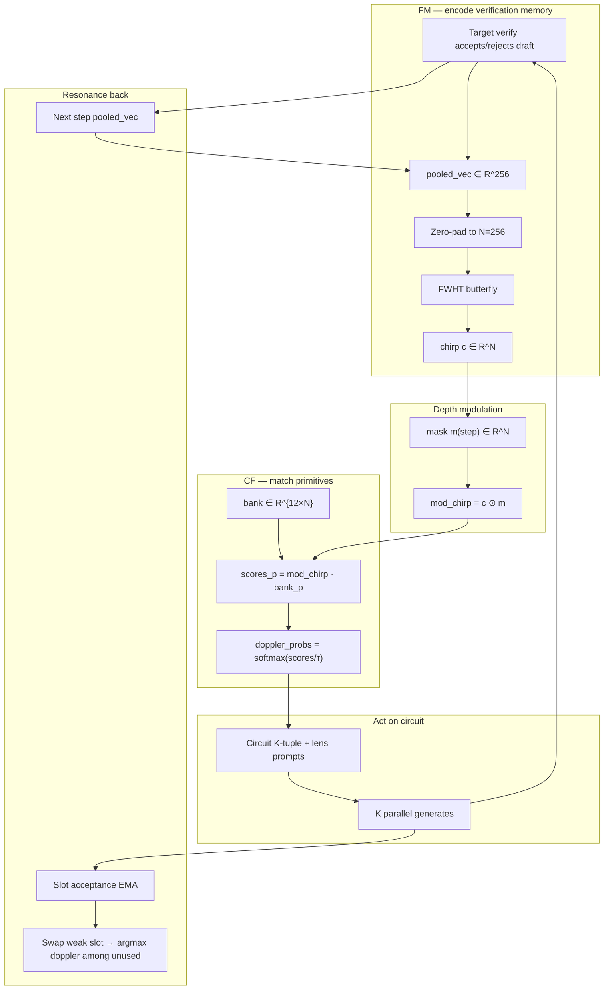
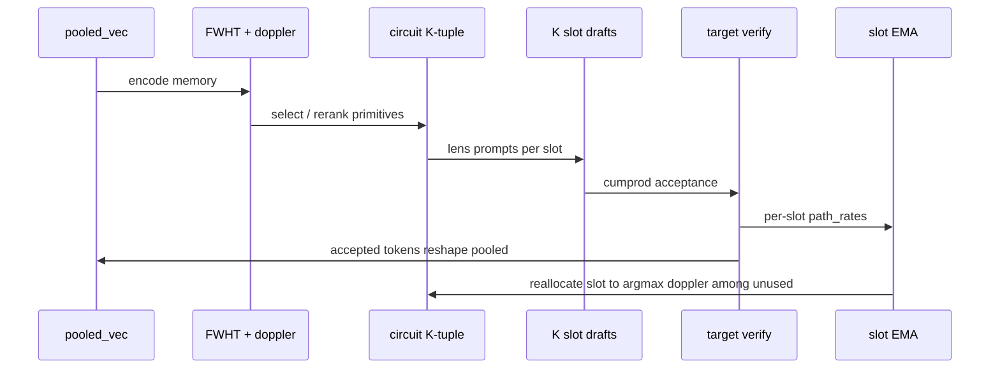
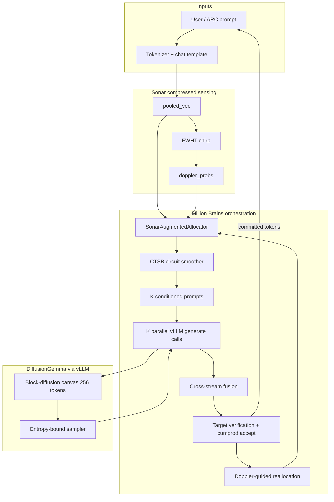
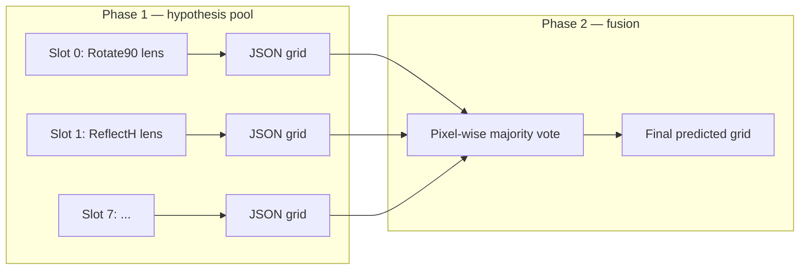

# one-million-brains-diffusiongemma


**Sonar-Augmented Permutation-Gated Feature-Slot Diffusion** — the Million Brains control plane wired into [DiffusionGemma](https://huggingface.co/google/diffusiongemma-26B-A4B-it) block-diffusion via orchestration-layer conditioning and training-free FM/CF compressed sensing.

This repository is a single-file research prototype (`million_brains_dflash.py`, ~6k lines) that runs on Kaggle or locally. It does **not** use draft-model speculative decoding or a multi-engine voter pool. One DiffusionGemma vLLM engine drives both the open-ended benchmark and ARC-AGI evaluation.

**Current script version:** `2026-06-19-diffusion-e` (Sonar resonance wrapper)

---

## Table of contents

1. [Executive summary](#executive-summary)
2. [What this is and is not](#what-this-is-and-is-not)
3. [The technique: bat-sonar compressed sensing](#the-technique-bat-sonar-compressed-sensing)
4. [Sonar resonance reference (FM/CF)](#sonar-resonance-reference-fmcf)
5. [Repository layout](#repository-layout)
6. [System architecture](#system-architecture)
7. [The circuit grammar (Million Brains control plane)](#the-circuit-grammar-million-brains-control-plane)
8. [DiffusionGemma engine integration](#diffusiongemma-engine-integration)
9. [Execution modes](#execution-modes)
10. [ARC-AGI evaluation pipeline](#arc-agi-evaluation-pipeline)
11. [The 12 spatial primitives](#the-12-spatial-primitives)
12. [Configuration reference](#configuration-reference)
13. [Kaggle setup (step by step)](#kaggle-setup-step-by-step)
14. [Local development](#local-development)
15. [Command-line interface](#command-line-interface)
16. [Output artifacts and grading](#output-artifacts-and-grading)
17. [Reading the logs](#reading-the-logs)
18. [Hardware, VRAM, and performance tuning](#hardware-vram-and-performance-tuning)
19. [Troubleshooting](#troubleshooting)
20. [Verification tests (no GPU)](#verification-tests-no-gpu)
21. [License and contributions](#license-and-contributions)

---

## Executive summary

| Layer | Role |
|-------|------|
| **DiffusionGemma (vLLM)** | Block-diffusion generative engine: 256-token canvas, entropy-bound denoising, iterative commit |
| **PermutationFeatureSlotAllocator** | Combinatorial backbone: pooled history → ordered K-tuple from P(12,K) via hash + combinadic unrank |
| **SonarCompressedSensingOrchestrator** | Training-free FM chirp (FWHT) + CF doppler resonance over 12 semantic Hadamard reflectors |
| **SonarAugmentedAllocator** | Wrapper preserving allocator contract; modes: `permutation`, `hybrid`, `sonar` |
| **CTSB** | Geodesic circuit morphing, discourse memory (optional chirp mixing), sampling-param interpolation |
| **Cross-stream fusion + verification** | K parallel proposals → fusion → target logprob verification → cumprod acceptance |
| **ARC spatial ensemble** | Phase 1: 8 primitive-conditioned JSON grids; Phase 2: pixel-wise majority vote |

At each denoise super-block the script runs **K parallel conditioned trajectories** (default `K=4`), fuses them, verifies against the target model, and commits accepted tokens. The Sonar layer compresses verification memory into a 1D FWHT chirp, matches it against 12 semantic Hadamard reflectors (doppler resonance), and uses the result to steer circuits and reallocation — see [The technique](#the-technique-bat-sonar-compressed-sensing). Feature injection today is **prompt + sampling-params + self-conditioning text**; KV chirp injection is **shaped and logged only** until a kernel patch can project through frozen `W_k/W_v`.

---

## What this is and is not

### This repo **is**

- A **DiffusionGemma-first** Million Brains implementation with permutation-gated feature slots **plus** bat-sonar compressed sensing for zero-shot primitive resonance.
- An **ARC-AGI evaluator** with a two-phase spatial grid ensemble (hypothesis pool + pixel majority vote).
- A **self-contained Kaggle script** that resolves model paths, loads vLLM (with HF fallback), runs a smoke benchmark, and optionally scores an ARC split.
- A **training-free** orchestration layer: no backward passes, no learned allocator parameters.

### This repo is **not**

- Speculative decoding with a draft model.
- A multi-agent / multi-engine voter pool.
- A production inference server or training codebase.
- A guarantee of competitive ARC scores — it is an architecture demonstration and experimentation harness.

---

## The technique: bat-sonar compressed sensing

This section describes the core research idea implemented in `SonarCompressedSensingOrchestrator` — how verification memory is compressed into a 1D signal, matched against spatial primitives, and fed back into the Million Brains control loop **without training a single parameter**.

### The problem

Million Brains runs **K parallel trajectories** (default K=4), each conditioned on a different spatial primitive (`Rotate90`, `ColorMap`, …). At every denoise super-block the system must answer:

1. **Which primitives** should occupy the K slots? (circuit selection)
2. **What memory** should the slots share? (cross-agent context without full text traces)
3. **When should a slot be swapped?** (adaptive reallocation after poor acceptance)

The original allocator solved (1) with combinatorial hashing: `pooled_vec` → seed → rank mod P(12,K) → combinadic unrank. That explores the full permutation grammar but only sees **two scalar moments** (mean and variance) of the pooled vector.

Sonar compressed sensing adds a **full-geometry readout** of the same pooled memory via an orthogonal 1D measurement (the chirp), then uses **resonance** (inner products against fixed primitive reflectors) to steer slots and reallocation. The metaphor is bat FM/CF sonar: emit a chirp, listen for which reflector rings loudest.

### Design constraints

| Constraint | How the technique respects it |
|------------|-------------------------------|
| **No training** | FWHT, depth masks, reflector bank, and softmax are fixed buffers; `requires_grad=False` everywhere |
| **No backward pass** | Pure forward linear algebra on `pooled_vec` |
| **Preserve circuit grammar** | Default `hybrid` mode keeps hash-unrank as primary; doppler only advises |
| **Don't break attention (yet)** | Chirp is **not** injected into Gemma K/V today; prompts remain the active conditioner |

### Pipeline overview



### Step 1 — Verification memory (`pooled_vec`)

After each target-verification forward, the system needs a compact summary of what was just accepted or rejected.

**Today (script simulation):** `make_pooled_state()` folds the last 16 committed token IDs plus step-dependent noise into a 256-dim float vector. This is a cheap stand-in for true hidden-state pooling.

**Target kernel integration:** `pooled_vec` would be the mean-pooled last-layer hidden state of DiffusionGemma immediately after cumprod verification — the rolling "target memory" of the canvas.

The Sonar path treats `pooled_vec` as a **high-dimensional scene** to be encoded, analogous to a bat's 3D environment.

### Step 2 — FM chirp (Fast Walsh-Hadamard Transform)

The **FM (frequency-modulated) chirp** is a lossless re-basis of pooled memory into Walsh coordinates.

**Pad** to the nearest power of two (256 for `internal_dim=256`):

```text
x = [ pooled_flat | 0, …, 0 ]     ∈ R^N,   N = 2^⌈log₂ D⌉
```

**FWHT** via butterfly additions/subtractions (implemented in `_fast_walsh_hadamard_transform_butterfly`):

```text
for stride h = 1, 2, 4, …, N/2:
    for each butterfly pair (i, i+h):
        a, b ← x[i], x[i+h]
        x[i]   ← a + b
        x[i+h] ← a − b

chirp c = x / √N
```

**Why FWHT?**

| Property | Implication |
|----------|-------------|
| **Orthogonal** | `FWHT(FWHT(x)) = x` — no information destroyed, only re-basis'd |
| **Energy-preserving (Parseval)** | `‖c‖ ≈ ‖pooled_vec‖` |
| **Fixed measurement matrix** | Acts as an untrained compressed-sensing operator — no learned projection |
| **O(N log N)** | Cheap enough to run every super-block on CPU |

Each Walsh coefficient is an equal-weight sum/difference across **all** input dimensions. The chirp is a 1D "pulse signature" of the entire verification state — the outgoing bat chirp.

### Step 3 — Depth modulation (step-aware bandpass)

Before matching primitives, the chirp is element-wise multiplied by a **depth mask** `m(step)` that depends on the denoise super-block index:

```text
mod_chirp = c ⊙ m(step)
```

Walsh index `i` is split at `N/2`:

| Index range | Interpretation in this prototype |
|-------------|----------------------------------|
| `i < N/2` (low Walsh bands) | Slow, global structure — proxy for causal/reasoning patterns in deep steps |
| `i ≥ N/2` (high Walsh bands) | Fine-grained mixing — proxy for spatial/token detail in early steps |

| Step region | Mask weights | Intent |
|-------------|--------------|--------|
| `step ≤ SONAR_EARLY_STEP_THRESHOLD` (default 4) | low=0.3, high=1.0 | Early denoise: emphasize spatial facts (`CropBBox`, `ComponentExtract`, …) |
| `step ≥ SONAR_DEEP_STEP_THRESHOLD` (default 12) | low=1.0, high=0.3 | Deep denoise: emphasize rule-level primitives (`ColorMap`, `SymmetryComplete`, …) |
| Between | Linear crossfade | Smooth handoff |

This is the **layer-aware compression** idea: the same chirp is read differently depending on where you are in the diffusion trajectory, without touching Gemma weights.

### Step 4 — CF reflector bank (semantic Hadamard primitives)

The **CF (constant-frequency) stage** treats each of the 12 spatial primitives as a fixed **reflector** with a known echo signature.

The reflector bank `bank ∈ R^{12 × N}` is built once at init (`_build_semantic_hadamard_bank`):

1. Compute the Hadamard matrix `H` by applying FWHT to `I_N` (identity).
2. Permute rows with seed `SONAR_PRIMITIVE_BANK_SEED` so primitive order is deterministic but not trivial.
3. For each primitive `p`, derive a **lens fingerprint** by hashing `SPATIAL_PRIMITIVE_LENSES[p]` into `R^N`.
4. Set `bank_p = normalize(H[row_p] ⊙ (0.65 + 0.35 · lens_fp_p))`.

**Why not random embeddings?** A `torch.randn(12, N)` bank would produce geometric resonance with no tie to `Rotate90` vs `ColorMap`. The semantic Hadamard construction ties each reflector to its prompt lens text while keeping rows nearly orthogonal (Hadamard backbone).

### Step 5 — Doppler shift / resonance (the core match)

**Resonance** is a batch of inner products — which reflector best aligns with the modulated chirp:

```text
score_p = ⟨ mod_chirp, bank_p ⟩     for p ∈ {0,…,11}

doppler_probs = softmax(score / τ)    τ = SONAR_DOPPLER_TEMPERATURE
```

- **High `doppler_probs[p]`** — pooled memory, as seen through the step-aware Walsh filter, correlates with primitive `p`'s reflector geometry.
- **Peaked distribution** — the system is confident about one transformation lens.
- **Flat distribution** — ambiguous memory; hash-unrank or CTSB smoothing should dominate.

This is the **zero-shot primitive classifier**: no fine-tuning, just linear algebra on frozen reflectors.

### Step 6 — From resonance to feature and circuit

| Term | Definition | How Sonar decides it |
|------|------------|----------------------|
| **Feature** | One primitive index `p ∈ {0..11}` | `argmax(doppler_probs)` or one slot in the K-tuple |
| **Circuit** | Ordered K-tuple of **distinct** primitives, one per parallel slot | Mode-dependent (below) |

**`ALLOCATOR_MODE = "sonar"`** — doppler is the primary selector:

```text
circuit = top-K distinct p by doppler_probs   (K parallel slots)
```

**`ALLOCATOR_MODE = "hybrid"`** (default) — permutation grammar is primary, doppler advises:

```text
base_circuit = hash_unrank(pooled, step) mod P(12,K)

if doppler_peak − doppler[worst_assigned] ≥ SONAR_DOPPLER_RERANK_MARGIN:
    swap ≤ 1 slot (on step % K schedule) to highest-resonance unused primitive

final_circuit = base_circuit after optional swap
```

**`ALLOCATOR_MODE = "permutation"`** — Sonar disabled; legacy hash only.

Hybrid mode preserves **11,880** possible ordered circuits for K=4 while letting resonance correct a clearly wrong slot when the doppler margin is large.

### Step 7 — Resonance back (closed-loop feedback)

Resonance is not computed once — it closes through verification:



**Implicit feedback:** Accepted tokens change `make_pooled_state()` → different FWHT coefficients → shifted `doppler_probs` → different circuit on the next step.

**Explicit feedback:** When slot `i` has `ema_accept[i] < ACCEPTANCE_THRESHOLD`, the system replaces that slot's primitive with `argmax_{p ∉ circuit} doppler_probs[p]` (instead of a round-robin hash).

**CTSB smoothing:** The discourse buffer (DSB) can mix in 15% of the truncated chirp (`SONAR_CHIRP_IN_DISCOURSE`) so cross-block memory carries the compressed pulse, not just token IDs — a LatentMAS-style shared latent without exposing full text traces between agents.

### Step 8 — KV chirp injection (future / stub today)

The chirp is also shaped for **persistent draft-layer conditioning**:

```text
kv_chirp_layer_L = reshape(chirp ⊙ layer_mod(L), [num_heads, head_dim])
```

`format_kv_chirp_for_layer()` produces one tensor per layer in `kv_chirp_by_layer`. The intended kernel algebra is:

```text
K' = K + W_k · kv_chirp
V' = V + W_v · kv_chirp
```

**Not active in vLLM today.** Raw Walsh coefficients live in a different basis than Gemma token embeddings; injecting without a frozen projection bridge would perturb `QK^T/√d` attention patterns the model never saw. The stub logs shaped tensors for future kernel validation.

### What is active vs planned

| Mechanism | Status in `diffusion-e` |
|-----------|-------------------------|
| FWHT chirp from `pooled_vec` | **Active** |
| Depth-modulated doppler_probs | **Active** |
| Hybrid / sonar circuit selection | **Active** |
| Doppler-guided slot reallocation | **Active** |
| Chirp mixed into CTSB discourse | **Active** when `SONAR_CHIRP_IN_DISCOURSE=True` |
| Per-slot spatial lens prompts | **Active** (primary conditioner) |
| `kv_chirp_by_layer` → Gemma K/V | **Stub only** (logged, not injected) |

### Worked example (K=4, hybrid mode)

Suppose after verification the pooled state encodes rotation-like structure.

**FM chirp** (step 2, early high-pass mask):

```text
doppler_probs ≈ [Rotate90: 0.31, ColorMap: 0.18, Transpose: 0.14, Rotate180: 0.09, …]
```

**Hash unrank** might assign `base_circuit = [Transpose, FloodFill, GravityShift, CropBBox]`.

**Hybrid check:** `doppler_probs[Rotate90] − doppler_probs[Transpose] = 0.17 ≥ 0.15` (margin met). On slot `step % 4 = 2`, swap `GravityShift` → `Rotate90` if `Rotate90` is unused.

**Draft:** Slot 2 now gets the `Rotate90` lens prompt; other slots keep their hash-assigned primitives.

**Next step:** If Rotate90 slot accepts 0/6 tokens, EMA drops below 0.28 → reallocate to next-highest unused doppler peak (e.g. `ColorMap`).

### Implementation map

| Concept | Code location |
|---------|---------------|
| FWHT butterfly | `_fast_walsh_hadamard_transform_butterfly` |
| Semantic reflector bank | `_build_semantic_hadamard_bank` |
| FM + CF orchestrator | `SonarCompressedSensingOrchestrator` |
| Hybrid / sonar wrapper | `SonarAugmentedAllocator` |
| Factory entry point | `make_feature_slot_allocator()` |
| Toggles | `ALLOCATOR_MODE`, `SONAR_*` constants at top of script |

---

## Sonar resonance reference (FM/CF)

Quick-reference card for operators. Full derivation is in [The technique](#the-technique-bat-sonar-compressed-sensing) above.

### Signal chain (one line)

```text
pooled → FWHT → chirp → depth_mask(step) → dot(bank) → softmax → doppler_probs → circuit
```

### Bio-acoustic mapping

| Bat sonar | Million Brains |
|-----------|----------------|
| FM outgoing chirp | `FWHT(pooled_vec) / √N` |
| Echo from reflector | `⟨mod_chirp, bank_p⟩` |
| Doppler comparison | `softmax(scores / τ)` → `doppler_probs` |
| Object ID | Primitive index / ordered K-tuple |

### Allocator modes

| Mode | Circuit selection |
|------|-------------------|
| `permutation` | Hash → combinadic unrank only |
| `hybrid` (**default**) | Hash primary + ≤1 doppler swap/step |
| `sonar` | `topk(doppler_probs, K)` primary |

### Log line

When `STREAM_ALL_OUTPUT=True`, each denoise step prints:

```text
[SONAR] step=03 top=Rotate90 p=0.312 chirp_norm=1.414 mode=hybrid
```

---

## Repository layout

| Path | Purpose |
|------|---------|
| `million_brains_dflash.py` | **Main entry point.** Toggles, Sonar orchestrator, MBR denoising, ARC eval, benchmark, CLI |
| `agent-tools/verify_arc_phase1.py` | CPU-only unit tests |
| `agent-tools/test_pixel_vote.py` | Pixel majority vote tests |
| `data/` | Optional local ARC JSON (gitignored) |
| `README.md` | This document |

---

## System architecture

### High-level data flow



### ARC eval data flow



**Important:** `K=4` (benchmark denoise parallelism) and `ARC_HYPOTHESIS_SLOTS=8` (ARC proposal count) are **independent**.

---

## The circuit grammar (Million Brains control plane)

### 1. SonarAugmentedAllocator

Wraps `PermutationFeatureSlotAllocator` and `SonarCompressedSensingOrchestrator`.

**Forward contract (unchanged for CTSB / ARC):**

```python
{
    "feature_indices", "feature_vectors", "gates",
    "stream_pos", "feature_names",
    # Sonar extensions:
    "doppler_probs", "kv_chirp_injection", "kv_chirp_by_layer",
    "selected_primitives", "chirp_norm", "allocator_mode",
}
```

**Hybrid selection (default):**

```text
base = hash(pooled, step) % P(12,K) → unrank
if doppler_peak - doppler[assigned_slot] > SONAR_DOPPLER_RERANK_MARGIN:
    swap ≤1 slot to highest-resonance unused primitive
```

### 2. PermutationFeatureSlotAllocator (backbone)

```text
pooled_history + step  →  hash  →  rank  →  unrank  →  [f₀, f₁, …, f_{K-1}]
```

Combinatorial grammar: **P(12, K) = 11,880** ordered circuits for K=4.

### 3. Pooled state (`make_pooled_state`)

History-dependent 256-dim vector from committed token tail + step noise. In a kernel integration this becomes mean-pooled last-layer hidden state after verification.

### 4. CTSB — Circuit Transition Smoothing Block

When `ENABLE_CIRCUIT_SMOOTHING = True`:

| Subsystem | Behavior |
|-----------|----------|
| DSB | EMA of verification + lexical structure; optional chirp term (`SONAR_CHIRP_IN_DISCOURSE`) |
| CBF | Blends previous and target feature embeddings |
| SPI | Interpolates temperature / top_p / repetition_penalty |
| Geodesic slot step | ≤ `CTSB_MAX_SLOT_SWAPS` identity changes per block |
| TAFK | Picks commit path by acceptance + coherence |

### 5. Conditioned denoising loop

Each super-block:

1. **Allocate** — `make_feature_slot_allocator()(pooled, step)` → circuit + doppler
2. **Condition** — per-slot lens prompts + sampling params
3. **Draft** — K parallel `vllm_llm.generate()` calls
4. **Fuse** — anchor or plurality
5. **Verify** — target logprobs + cumprod acceptance
6. **Reallocate** — doppler-guided swap for underperforming slots
7. **Reframe** — temperature boost on total rejection

### 6. Feature injection model

| Mechanism | Status |
|-----------|--------|
| Per-slot lens prompt prefix | **Active** |
| Per-slot temperature / top_p | **Active** |
| Self-conditioning prior canvas | **Active** |
| Sonar doppler reallocation bias | **Active** (hybrid/sonar modes) |
| CTSB chirp discourse mixing | **Active** when `SONAR_CHIRP_IN_DISCOURSE` |
| `kv_chirp_by_layer` stub | **Logged only** |
| Hidden-state K/V injection in transformer | **Not implemented** (future kernel) |

---

## DiffusionGemma engine integration

### Model resolution order

1. `KAGGLE_DIFFUSIONGEMMA_DIR`
2. `LOCAL_DIFFUSIONGEMMA_DIR`
3. `/kaggle/working` prefetch cache
4. HuggingFace: `DIFFUSIONGEMMA_MODEL_PRIMARY` then `DIFFUSIONGEMMA_MODEL_FALLBACK`

### vLLM configuration

| Parameter | Default | Notes |
|-----------|---------|-------|
| `diffusion_config.canvas_length` | 256 | Block canvas |
| `hf_overrides.diffusion_sampler` | `entropy_bound` | |
| `max_num_seqs` | 4 | Keep low for diffusion VRAM |
| `max_model_len` | 8192 | |
| `gpu_memory_utilization` | 0.85 | |

### Load fallback chain

1. vLLM with CUDA graphs
2. vLLM `enforce_eager=True`
3. `HFGenerateEngine` if `VLLM_FALLBACK_TO_HF = True`

---

## Execution modes

```text
1. Parse CLI + resolve ARC paths
2. ensure_model_available()
3. load_models() — DiffusionGemma + tokenizer
4. verify_inference_engine()
5. ARC eval if data found
6. Demo benchmark if enabled
7. Write million_brains_dflash_results.json
```

### Demo benchmark

Uses `million_brains_diffusion_denoise_generate()` with `K=4`, `BLOCK_SIZE=6`, `TARGET_MAX_TOKENS=160`.

Reports: tokens/sec, super-blocks, acceptance trajectory, feature reallocations, **doppler_probs** per step (verbose).

---

## ARC-AGI evaluation pipeline

### Data sources

| `ARC_DATA_PROFILE` | Behavior |
|--------------------|----------|
| `auto` | Kaggle mount if present, else `data/` |
| `kaggle` | Force competition path |
| `local` | `data/` |
| `off` | No ARC eval |

### Spatial grid ensemble (default)

**Phase 1:** `collect_spatial_grid_hypotheses` — allocator picks 8 primitives, greedy JSON grids per slot.

**Phase 2:** `pixel_wise_majority_vote_grids` — deterministic per-cell plurality.

### Token budget

`ARC_MBR_OUTPUT_TOKEN_BUDGET = 14000` per test case. Per-slot cap ≈ `(budget - final_reserve) / ARC_HYPOTHESIS_SLOTS`.

---

## The 12 spatial primitives

| Primitive | Lens (abbreviated) |
|-----------|-------------------|
| `Rotate90` | 90° clockwise rotation |
| `Rotate180` | 180° rotation |
| `ReflectH` | Horizontal mirror |
| `ReflectV` | Vertical mirror |
| `Transpose` | Matrix transpose / axis swap |
| `CropBBox` | Crop to minimal bounding box |
| `TileRepeat` | Tiling / motif repetition |
| `ColorMap` | Deterministic color permutation 0–9 |
| `SymmetryComplete` | Complete partial symmetries |
| `FloodFill` | Flood-fill enclosed regions |
| `ComponentExtract` | Extract connected components |
| `GravityShift` | Gravity shift on non-zero cells |

Each primitive has a **semantic Hadamard reflector** in the Sonar bank for CF resonance matching.

---

## Configuration reference

All toggles live in the **`TOGGLES` block** at the top of `million_brains_dflash.py`.

### Sonar compressed sensing

| Constant | Default | Description |
|----------|---------|-------------|
| `ALLOCATOR_MODE` | `hybrid` | `permutation` \| `hybrid` \| `sonar` |
| `SONAR_DOPPLER_TEMPERATURE` | 1.0 | Softmax temperature for doppler |
| `SONAR_DOPPLER_RERANK_MARGIN` | 0.15 | Hybrid swap threshold |
| `SONAR_EARLY_STEP_THRESHOLD` | 4 | High-pass band emphasis below |
| `SONAR_DEEP_STEP_THRESHOLD` | 12 | Low-pass band emphasis above |
| `SONAR_CHIRP_IN_DISCOURSE` | True | Mix chirp into CTSB DSB |
| `SONAR_KV_STUB_ENABLED` | True | Shape per-layer KV chirp tensors |
| `SONAR_PRIMITIVE_BANK_SEED` | 42 | Deterministic reflector bank |
| `SONAR_KV_HEAD_DIM` | 128 | KV stub head dimension |
| `SONAR_KV_NUM_HEADS` | 8 | KV stub head count |
| `SONAR_KV_NUM_LAYERS` | 32 | KV stub layer count |

### Million Brains denoise

| Constant | Default | Description |
|----------|---------|-------------|
| `K` | 4 | Parallel trajectories per super-block |
| `BLOCK_SIZE` | 6 | Tokens per super-block |
| `ENABLE_FEATURE_REALLOCATION` | True | Swap underperforming slots |
| `ACCEPTANCE_THRESHOLD` | 0.28 | EMA reallocation threshold |
| `ENABLE_CIRCUIT_SMOOTHING` | True | CTSB master switch |
| `ALLOCATOR_MODE` | `hybrid` | Sonar integration mode |

### ARC evaluation

| Constant | Default | Description |
|----------|---------|-------------|
| `ARC_HYPOTHESIS_SLOTS` | 8 | Phase-1 proposal count |
| `ARC_SPATIAL_GRID_ENSEMBLE` | True | Grid + pixel vote |
| `ARC_MBR_OUTPUT_TOKEN_BUDGET` | 14000 | Output tokens per test |

---

## Kaggle setup (step by step)

### 1. Create notebook

GPU: **A100 80GB** recommended; **L4** works with patience.

### 2. Add inputs

| Input | Mount |
|-------|-------|
| `google/diffusiongemma` | `/kaggle/input/models/google/diffusiongemma/transformers/diffusiongemma-26b-a4b-it/1` |
| `arc-prize-2026-arc-agi-2` | `/kaggle/input/competitions/arc-prize-2026-arc-agi-2` |

### 3. Verify toggles

```python
ALLOCATOR_MODE = "hybrid"  # or "permutation" for legacy-only
KAGGLE_DIFFUSIONGEMMA_DIR = "/kaggle/input/models/google/diffusiongemma/transformers/diffusiongemma-26b-a4b-it/1"
ARC_DATA_PROFILE = "auto"
```

### 4. Run

Expected banner: `ONE-MILLION-BRAINS-DIFFUSIONGEMMA INITIALIZED` with `SCRIPT_VERSION = 2026-06-19-diffusion-e`.

---

## Local development

```bash
git clone https://github.com/iblameandrew/one-million-brains-speculative-decoding.git
cd one-million-brains-speculative-decoding

python million_brains_dflash.py --arc-profile off --demo-only
python million_brains_dflash.py --arc-profile local --eval-max-tasks 2
```

---

## Command-line interface

```
python million_brains_dflash.py [options]
```

| Flag | Description |
|------|-------------|
| `--arc-profile {auto,kaggle,local,off}` | ARC data source |
| `--arc-split {training,evaluation}` | ARC split |
| `--eval-max-tasks N` | Limit tasks |
| `--demo-only` | Skip ARC |
| `--run-demo-benchmark` | Also run benchmark |

---

## Output artifacts and grading

### `million_brains_dflash_results.json`

Includes `allocator_mode`, `script_version`, benchmark metrics, ARC accuracy.

### Key log prefixes

| Prefix | Meaning |
|--------|---------|
| `[MBR-DIFFUSION]` | Benchmark denoise loop |
| `[DENOISE slot N]` | Per-slot draft |
| `[SONAR]` | Chirp norm + top doppler primitive (verbose) |
| `[ARC-PHASE-1]` | Spatial hypothesis generation |
| `[FINAL][arc]` | Dataset accuracy |

---

## Hardware, VRAM, and performance tuning

| GPU | Notes |
|-----|-------|
| A100 80GB | Comfortable for 26B + K=4 |
| L4 24GB | Smoke tests; sequential ARC slots |
| CPU | HF fallback only; not practical for 26B |

Sonar FWHT/doppler adds negligible CPU overhead vs vLLM generation.

---

## Troubleshooting

| Problem | Fix |
|---------|-----|
| Circuit flips too often | Set `ALLOCATOR_MODE = "permutation"` or raise `SONAR_DOPPLER_RERANK_MARGIN` |
| Want full sonar selector | Set `ALLOCATOR_MODE = "sonar"` (monitor acceptance) |
| No DiffusionGemma checkpoint | Add Kaggle model input |
| Phase 1 stuck at `0/8` | Normal on L4; wait for slot logs |

---

## Verification tests (no GPU)

```bash
python agent-tools/verify_arc_phase1.py
python -c "from million_brains_dflash import make_feature_slot_allocator; a=make_feature_slot_allocator(); import torch; o=a(torch.randn(1,256),0); assert 'doppler_probs' in o"
```

Sonar-specific checks:

- FWHT orthogonality: `||FWHT(x)|| ≈ ||x||`
- `doppler_probs.sum() ≈ 1`
- Determinism: same pooled + step → identical output
- Hybrid mode preserves hash circuit when margin below threshold

---

## License and contributions

Educational and research prototype. Pull requests welcome — especially kernel-level K/V chirp injection with frozen projection bridges.

---

## Quick reference card

```text
Engine:     DiffusionGemma-26B-A4B-it via vLLM block-diffusion
Technique:  Bat-sonar compressed sensing (training-free FM/CF)
  FM:       pooled_vec → FWHT → 1D chirp (orthogonal measurement)
  CF:       mod_chirp · semantic_Hadamard_bank → doppler_probs
  Back:     verify → new pooled → new chirp; weak slots → doppler reallocate
Control:    12 spatial primitives → P(12,K) permutation + Sonar resonance
Modes:      permutation | hybrid (default) | sonar
Benchmark:  K=4 denoise trajectories × 6 tokens/step × verify loop
ARC:        8 spatial grid hypotheses → pixel majority vote
Config:     TOGGLES block in million_brains_dflash.py
Version:    2026-06-19-diffusion-e
```