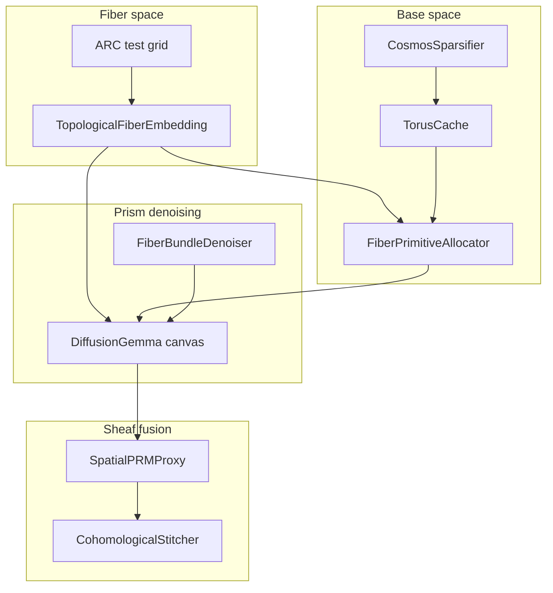

# Topological Fiber-Bundle Diffusion (TFBD)


**Topological Fiber-Bundle Diffusion × DiffusionGemma** — a production research prototype for ARC-AGI matrix completion using structured 2D/3D fiber embeddings over [DiffusionGemma](https://huggingface.co/google/diffusiongemma-26B-A4B-it) block diffusion.

This repository is a single-file harness (`tfbd.py`, ~7.6k lines) that runs on Kaggle or locally. It replaces the deprecated 1D Sonar / CTSB projection (combinatorial token-sequence bottleneck) with a fiber-bundle architecture over the diffusion canvas.

**Current script version:** `2026-06-20-tfbd-a`

---

## Table of contents

1. [Executive summary](#executive-summary)
2. [What this is and is not](#what-this-is-and-is-not)
3. [TFBD architecture](#tfbd-architecture)
4. [Repository layout](#repository-layout)
5. [System architecture](#system-architecture)
6. [DiffusionGemma integration](#diffusiongemma-integration)
7. [Execution modes](#execution-modes)
8. [ARC-AGI evaluation pipeline](#arc-agi-evaluation-pipeline)
9. [The 12 spatial primitives](#the-12-spatial-primitives)
10. [Configuration reference](#configuration-reference)
11. [Kaggle setup](#kaggle-setup)
12. [Local development](#local-development)
13. [Command-line interface](#command-line-interface)
14. [Output artifacts](#output-artifacts)
15. [Reading the logs](#reading-the-logs)
16. [Hardware and tuning](#hardware-and-tuning)
17. [Troubleshooting](#troubleshooting)
18. [Verification tests](#verification-tests)

---

## Executive summary

| Layer | Role |
|-------|------|
| **DiffusionGemma (HF / vLLM)** | Block-diffusion engine: 256-token canvas, iterative denoise + commit |
| **TopologicalFiberEmbedding** | Per-cell `E = E_value + E_row + E_col + E_symmetry` (GSDM-style D4 sharing) |
| **CosmosSparsifier + TorusCache** | Latent feature sparsification + `T²` projection (base-space skeleton) |
| **FiberBundleDenoiser** | Partial re-masking: lock logic skeleton, explore fiber stalks |
| **CohomologicalStitcher** | K-trajectory copresheaf stitch + homology PRM (Betti / Euler proxy) |
| **TFBD_Orchestrator** | Wraps `DiffusionGemmaForBlockDiffusion`, fiber KV bias + `inputs_embeds` injection |
| **ARC spatial ensemble** | Phase 1: 8 primitive JSON grids with fiber injection; Phase 2: PRM stitch |

Default backend is **HuggingFace** (`INFERENCE_BACKEND = "hf"`). Set `INFERENCE_BACKEND = "vllm"` for optimized serving when a DiffusionGemma-capable vLLM build is available.

---

## What this is and is not

### This repo **is**

- A **TFBD-first** ARC-AGI evaluator with structured grid geometry in the diffusion loop.
- A **self-contained Kaggle script** (`tfbd.py`) with model path resolution, ARC scoring, and benchmark harness.
- A **training-free** orchestration layer: fixed embeddings, sparsifiers, and homology proxies — no backward passes.

### This repo is **not**

- The legacy 1D Sonar FWHT / bat-echolocation stack (removed; see git history).
- Speculative decoding with a draft model or a multi-engine voter pool.
- A guarantee of competitive ARC scores — an architecture demonstration and experimentation harness.

---

## TFBD architecture

### 1. Fiber space — `TopologicalFiberEmbedding`

Each ARC cell `(r, c, v)` maps to a composite embedding:

```text
E(r,c,v) = E_value(v) + E_row(r) + E_col(c) + E_symmetry(orbit_D4(r,c))
```

Cells in the same dihedral orbit share symmetry parameters (permutation-invariant node sharing, GSDM-inspired).

### 2. Base space — `CosmosSparsifier` + `TorusCache`

- **CosmosSparsifier:** randomly zeros proportion `TFBD_SPARSITY_P` of coordinates inside each latent vector during inference, forcing redundant topological cue storage.
- **TorusCache:** pairs latent dimensions into angular coordinates on `T² = S¹ × S¹` via `atan2`, then re-lifts through `cos/sin` to avoid concentration of measure in high-dimensional discourse buffers.

### 3. Prism denoising — `FiberBundleDenoiser`

Overrides naive block diffusion with **partial re-masking**:

- **Base space (logic skeleton):** tokens with confidence ≥ `TFBD_CONFIDENCE_LOCK` are locked.
- **Fiber space (grid stalks):** low-confidence spatial positions are re-masked (`TFBD_REMASK_FRACTION`) so diverse grid implementations are explored without destroying underlying rule structure.

### 4. Sheaf stitch — `CohomologicalStitcher` + `SpatialPRMProxy`

- Runs **K parallel trajectories** (default `K=4` in benchmark, `8` slots in ARC Phase 1).
- **SpatialPRMProxy** scores grids via homology proxies: connected components (β₀), cycle holes (β₁), Euler characteristic χ.
- **CohomologicalStitcher** fuses row stalks using copresheaf restriction maps (directional, anisotropic glue).

### 5. Orchestrator — `TFBD_Orchestrator`

- Binds to `DiffusionGemmaForBlockDiffusion` through `HFGenerateEngine`.
- Injects fiber coordinates into `inputs_embeds` and builds per-layer spatial bias matrices for attention (`TFBD_KV_BIAS_SCALE`).
- Public helpers: `make_tfbd_orchestrator()`, `tfbd_generate()`.



---

## Repository layout

| Path | Purpose |
|------|---------|
| `tfbd.py` | **Main entry point.** TFBD modules, DiffusionGemma load, ARC eval, benchmark, CLI |
| `agent-tools/verify_arc_phase1.py` | CPU-only structure / budget tests |
| `agent-tools/test_pixel_vote.py` | Pixel vote unit tests |
| `data/` | Optional local ARC JSON (gitignored) |
| `README.md` | This document |

**Renamed from:** `sonar.py` / `million_brains_dflash.py` (deprecated aliases remain in `tfbd.py` for notebook compat).

---

## System architecture

### Benchmark denoise loop

1. `FiberPrimitiveAllocator` picks K primitives via fiber-space resonance.
2. Fiber-bundle transition smoothing (legacy CTSB compat) on torus discourse buffer.
3. K conditioned prompts → parallel `generate()` calls.
4. Verification + cumprod acceptance commits tokens.
5. Doppler-guided reallocation on weak slots.

### ARC eval (default: spatial ensemble)

**Phase 1:** `collect_spatial_grid_hypotheses` — 8 primitive-conditioned JSON grids with `TopologicalFiberEmbedding` injected from test input when `ENABLE_TFBD=True`.

**Phase 2:** `CohomologicalStitcher` (TFBD) or pixel majority vote (legacy when `ENABLE_TFBD=False`).

**Important:** `K=4` (benchmark parallelism) and `ARC_HYPOTHESIS_SLOTS=8` (ARC proposal count) are independent.

---

## DiffusionGemma integration

| Setting | Default | Notes |
|---------|---------|-------|
| `INFERENCE_BACKEND` | `hf` | `DiffusionGemmaForBlockDiffusion` + explicit layer `device_map` |
| `DIFFUSION_CANVAS_LENGTH` | 256 | Block canvas size |
| `DIFFUSION_MAX_MODEL_LEN` | 8192 | Raise on A100 if VRAM allows |
| `KAGGLE_DIFFUSIONGEMMA_DIR` | Kaggle model mount | See [Kaggle setup](#kaggle-setup) |

HF load path: `HFGenerateEngine` exposes a vLLM-compatible `generate()` API for ARC batching.

---

## Execution modes

| Mode | Trigger | Behavior |
|------|---------|----------|
| ARC eval | Default when ARC data paths resolve | Phase 1 + Phase 2 per test case |
| Demo benchmark | `--demo-only` or no ARC data | Open-ended TFBD denoise on `BENCHMARK_PROMPT` |
| Smoke | `--eval-max-tasks N` | Cap ARC tasks |

---

## ARC-AGI evaluation pipeline

### Data profiles

| `ARC_DATA_PROFILE` | Behavior |
|--------------------|----------|
| `auto` | Kaggle competition mount, else `data/` |
| `kaggle` | Force competition path |
| `local` | `data/` |
| `off` | No ARC eval |

### Token budget

`ARC_MBR_OUTPUT_TOKEN_BUDGET = 14000` per test case. Spatial slots use `budget / ARC_HYPOTHESIS_SLOTS` (no Phase-2 LLM reserve in spatial mode).

---

## The 12 spatial primitives

| Primitive | Lens (abbreviated) |
|-----------|-------------------|
| `Rotate90` | 90° clockwise rotation |
| `Rotate180` | 180° rotation |
| `ReflectH` | Horizontal mirror |
| `ReflectV` | Vertical mirror |
| `Transpose` | Matrix transpose |
| `CropBBox` | Crop to minimal bounding box |
| `TileRepeat` | Tiling / motif repetition |
| `ColorMap` | Color permutation 0–9 |
| `SymmetryComplete` | Complete partial symmetries |
| `FloodFill` | Flood-fill enclosed regions |
| `ComponentExtract` | Extract connected components |
| `GravityShift` | Gravity shift on non-zero cells |

Each primitive has a **fiber-space fingerprint** in `FiberPrimitiveAllocator` for resonance-based slot selection.

---

## Configuration reference

All toggles live in the **`TOGGLES` block** at the top of `tfbd.py`.

### TFBD core

| Constant | Default | Description |
|----------|---------|-------------|
| `ENABLE_TFBD` | `True` | Master switch for fiber-bundle path |
| `TFBD_FIBER_DIM` | 256 | Composite cell embedding width |
| `TFBD_SPARSITY_P` | 0.15 | CosmosSparsifier dropout |
| `TFBD_CONFIDENCE_LOCK` | 0.72 | Lock high-confidence base tokens |
| `TFBD_REMASK_FRACTION` | 0.35 | Re-mask low-confidence fiber positions |
| `TFBD_KV_BIAS_SCALE` | 0.08 | Attention spatial bias scale |
| `ALLOCATOR_MODE` | `fiber` | `permutation` \| `fiber` \| `hybrid` |

### Denoise / ARC

| Constant | Default | Description |
|----------|---------|-------------|
| `K` | 4 | Benchmark parallel trajectories |
| `ARC_HYPOTHESIS_SLOTS` | 8 | ARC Phase-1 proposal count |
| `ARC_SPATIAL_GRID_ENSEMBLE` | `True` | Grid hypotheses + stitch |
| `ARC_SPATIAL_ENABLE_THINKING` | `False` | Spatial slots emit JSON only |
| `ARC_MBR_OUTPUT_TOKEN_BUDGET` | 14000 | Output tokens per test |
| `INFERENCE_BACKEND` | `hf` | `hf` or `vllm` |

---

## Kaggle setup

### 1. Create notebook

GPU: **A100 80GB** recommended; **L4×4** works with patience.

### 2. Add inputs

| Input | Mount |
|-------|-------|
| `google/diffusiongemma` | `/kaggle/input/models/google/diffusiongemma/transformers/diffusiongemma-26b-a4b-it/1` |
| `arc-prize-2026-arc-agi-2` | `/kaggle/input/competitions/arc-prize-2026-arc-agi-2` |

### 3. Copy script

Upload or clone `tfbd.py` into the notebook working directory.

### 4. Verify toggles

```python
ENABLE_TFBD = True
INFERENCE_BACKEND = "hf"
KAGGLE_DIFFUSIONGEMMA_DIR = "/kaggle/input/models/google/diffusiongemma/transformers/diffusiongemma-26b-a4b-it/1"
ARC_DATA_PROFILE = "auto"
ARC_SPATIAL_ENABLE_THINKING = False  # JSON grids only in Phase 1
```

### 5. Run

```python
!python tfbd.py --arc-profile auto --arc-split evaluation
```

Expected banner: `TOPOLOGICAL-FIBER-BUNDLE-DIFFUSION INITIALIZED` with `SCRIPT_VERSION = 2026-06-20-tfbd-a`.

---

## Local development

```bash
git clone https://github.com/iblameandrew/sonar-augmented-diffusion.git
cd sonar-augmented-diffusion

python tfbd.py --arc-profile off --demo-only
python tfbd.py --arc-profile local --eval-max-tasks 2
```

---

## Command-line interface

```bash
python tfbd.py [options]
```

| Flag | Description |
|------|-------------|
| `--arc-profile {auto,kaggle,local,off}` | ARC data source |
| `--arc-split {training,evaluation}` | ARC split |
| `--eval-max-tasks N` | Limit tasks |
| `--demo-only` | Skip ARC |
| `--run-demo-benchmark` | Also run benchmark |

---

## Output artifacts

### `tfbd_results.json`

Written to `/kaggle/working/tfbd_results.json` on Kaggle (or `tfbd_results.json` locally). Includes `script_version`, benchmark metrics, ARC accuracy.

### Grade cards

PNG grade cards under `arc_grades/` (or `/kaggle/working/arc_grades/`).

---

## Reading the logs

| Prefix | Meaning |
|--------|---------|
| `[TFBD-DIFFUSION]` | Benchmark denoise loop |
| `[TFBD-FIBER]` | Fiber primitive resonance per step |
| `[TFBD-spatial/slot N]` | ARC Phase-1 slot with fiber injection |
| `[ARC-PHASE-1]` | Spatial hypothesis generation |
| `[ARC-PHASE-2]` | Cohomological stitch or pixel vote |
| `[FINAL][arc]` | Dataset accuracy |

---

## Hardware and tuning

| GPU | Notes |
|-----|-------|
| A100 80GB | Comfortable for 26B + batch ARC |
| L4×4 | HF explicit `device_map`; sequential Phase-1 slots |
| CPU | Not practical for 26B |

Raise `DIFFUSION_MAX_MODEL_LEN` (e.g. 16384) when prompts + large grid outputs exceed 8192 context.

---

## Troubleshooting

| Problem | Fix |
|---------|-----|
| `0/8 parsed grids` | Ensure `ARC_SPATIAL_ENABLE_THINKING=False`; check `[[` prefill; raise slot budget |
| OOM on load | Use HF backend; reduce `DIFFUSION_GPU_UTIL`; fewer GPUs with smaller layers |
| Guided JSON unavailable | Expected on PyPI vLLM; greedy parse fallback is used |
| Phase 1 stuck at `0/8` | Normal on L4 until first slot completes (~30–120s) |

---

## Verification tests

```bash
python agent-tools/verify_arc_phase1.py
python -c "import importlib.util; s=importlib.util.spec_from_file_location('tfbd','tfbd.py'); m=importlib.util.module_from_spec(s); s.loader.exec_module(m); import torch; o=m.make_feature_slot_allocator()(torch.randn(1,256),0); assert 'doppler_probs' in o"
```

---

## License and contributions

Educational and research prototype. Pull requests welcome — especially deeper attention-kernel integration for fiber bias matrices and persistent-homology PRM backends.

---

## Quick reference

```text
Script:     tfbd.py
Version:    2026-06-20-tfbd-a
Engine:     DiffusionGemma-26B-A4B-it (HF default, vLLM optional)
Technique:  Topological Fiber-Bundle Diffusion (TFBD)
ARC:        8 spatial grids → cohomological stitch (ENABLE_TFBD=True)
Benchmark:  K=4 fiber-bundle trajectories × block denoise × verify
Config:     TOGGLES block at top of tfbd.py
```