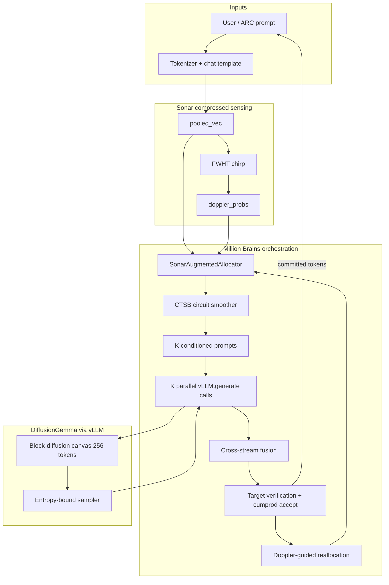
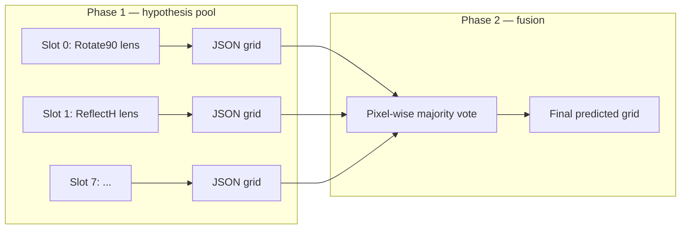

# one-million-brains-diffusiongemma


**Sonar-Augmented Permutation-Gated Feature-Slot Diffusion** — the Million Brains control plane wired into [DiffusionGemma](https://huggingface.co/google/diffusiongemma-26B-A4B-it) block-diffusion via orchestration-layer conditioning and training-free FM/CF compressed sensing.

This repository is a single-file research prototype (`million_brains_dflash.py`, ~6k lines) that runs on Kaggle or locally. It does **not** use draft-model speculative decoding or a multi-engine voter pool. One DiffusionGemma vLLM engine drives both the open-ended benchmark and ARC-AGI evaluation.

**Current script version:** `2026-06-19-diffusion-e` (Sonar resonance wrapper)

---

## Table of contents

1. [Executive summary](#executive-summary)
2. [What this is and is not](#what-this-is-and-is-not)
3. [Sonar resonance (FM/CF)](#sonar-resonance-fmcf)
4. [Repository layout](#repository-layout)
5. [System architecture](#system-architecture)
6. [The circuit grammar (Million Brains control plane)](#the-circuit-grammar-million-brains-control-plane)
7. [DiffusionGemma engine integration](#diffusiongemma-engine-integration)
8. [Execution modes](#execution-modes)
9. [ARC-AGI evaluation pipeline](#arc-agi-evaluation-pipeline)
10. [The 12 spatial primitives](#the-12-spatial-primitives)
11. [Configuration reference](#configuration-reference)
12. [Kaggle setup (step by step)](#kaggle-setup-step-by-step)
13. [Local development](#local-development)
14. [Command-line interface](#command-line-interface)
15. [Output artifacts and grading](#output-artifacts-and-grading)
16. [Reading the logs](#reading-the-logs)
17. [Hardware, VRAM, and performance tuning](#hardware-vram-and-performance-tuning)
18. [Troubleshooting](#troubleshooting)
19. [Verification tests (no GPU)](#verification-tests-no-gpu)
20. [License and contributions](#license-and-contributions)

---

## Executive summary

| Layer | Role |
|-------|------|
| **DiffusionGemma (vLLM)** | Block-diffusion generative engine: 256-token canvas, entropy-bound denoising, iterative commit |
| **PermutationFeatureSlotAllocator** | Combinatorial backbone: pooled history → ordered K-tuple from P(12,K) via hash + combinadic unrank |
| **SonarCompressedSensingOrchestrator** | Training-free FM chirp (FWHT) + CF doppler resonance over 12 semantic Hadamard reflectors |
| **SonarAugmentedAllocator** | Wrapper preserving allocator contract; modes: `permutation`, `hybrid`, `sonar` |
| **CTSB** | Geodesic circuit morphing, discourse memory (optional chirp mixing), sampling-param interpolation |
| **Cross-stream fusion + verification** | K parallel proposals → fusion → target logprob verification → cumprod acceptance |
| **ARC spatial ensemble** | Phase 1: 8 primitive-conditioned JSON grids; Phase 2: pixel-wise majority vote |

At each denoise super-block the script runs **K parallel conditioned trajectories** (default `K=4`), fuses them, verifies against the target model, and commits accepted tokens. Feature injection today is **prompt + sampling-params + self-conditioning text**. Sonar chirp KV injection is **shaped and logged only** until a kernel patch can project through frozen `W_k/W_v`.

---

## What this is and is not

### This repo **is**

- A **DiffusionGemma-first** Million Brains implementation with permutation-gated feature slots **plus** bat-sonar compressed sensing for zero-shot primitive resonance.
- An **ARC-AGI evaluator** with a two-phase spatial grid ensemble (hypothesis pool + pixel majority vote).
- A **self-contained Kaggle script** that resolves model paths, loads vLLM (with HF fallback), runs a smoke benchmark, and optionally scores an ARC split.
- A **training-free** orchestration layer: no backward passes, no learned allocator parameters.

### This repo is **not**

- Speculative decoding with a draft model.
- A multi-agent / multi-engine voter pool.
- A production inference server or training codebase.
- A guarantee of competitive ARC scores — it is an architecture demonstration and experimentation harness.

---

## Sonar resonance (FM/CF)

### What resonance means

**Resonance** is a deterministic inner-product match between two signals:

1. **FM chirp** — FWHT projection of verification memory (`pooled_vec`)
2. **CF reflector** — fixed orthogonal vector per spatial primitive

A primitive "rings" when `dot(modulated_chirp, bank[p])` is large. No training. No gradients.

```text
pooled_vec  →  pad to N=2^k  →  FWHT  →  chirp [N]
chirp       →  depth_mask(step)  →  mod_chirp
mod_chirp   →  dot(bank[0..11])  →  softmax  →  doppler_probs[12]
```

### Bio-acoustic mapping

| Bat sonar | Million Brains |
|-----------|----------------|
| FM outgoing chirp | `FWHT(pooled_vec) / sqrt(N)` |
| Echo from reflector | `dot(mod_chirp, primitive_bank[p])` |
| Doppler comparison | Relative scores → `doppler_probs` |
| Object ID | Primitive index / ordered K-tuple (circuit) |

### Depth modulation (step-aware)

| Step region | Walsh band emphasis | Intent |
|-------------|---------------------|--------|
| Early (`step < SONAR_EARLY_STEP_THRESHOLD`) | High indices boosted | Spatial / token-level detail |
| Deep (`step > SONAR_DEEP_STEP_THRESHOLD`) | Low indices boosted | Slower causal / reasoning patterns |
| Mid | Crossfade | Mixed |

### Semantic Hadamard reflector bank

Each of the 12 primitives gets a **deterministic orthogonal fingerprint**:

- Base: row from fixed Hadamard matrix (butterfly FWHT)
- Modulation: lens text hash from `SPATIAL_PRIMITIVE_LENSES`
- **Not** `torch.randn` — resonance is semantically grounded

### Allocator modes (`ALLOCATOR_MODE`)

| Mode | Circuit selection | Risk |
|------|-------------------|------|
| `permutation` | Hash → combinadic unrank only (legacy) | Lowest |
| `hybrid` (**default**) | Hash primary + doppler rerank (≤1 slot/step on margin) | Low |
| `sonar` | `topk(doppler_probs, K)` primary | Higher — full Walsh-space selector |

### Resonance back (closed loop)

```text
Step t:   pooled_t → chirp_t → doppler_t → circuit_t → K drafts → verify
Step t+1: accepted tokens reshape pooled_{t+1} → new chirp → shifted doppler
          poor slot EMA → reallocation picks max doppler among unused primitives
```

### KV chirp (stub)

`format_kv_chirp_for_layer()` shapes chirp to `[num_heads, head_dim]` per layer with depth modulation. Returned in `kv_chirp_by_layer` for logging. **Not injected into vLLM** until kernel integration validates attention stability.

---

## Repository layout

| Path | Purpose |
|------|---------|
| `million_brains_dflash.py` | **Main entry point.** Toggles, Sonar orchestrator, MBR denoising, ARC eval, benchmark, CLI |
| `agent-tools/verify_arc_phase1.py` | CPU-only unit tests |
| `agent-tools/test_pixel_vote.py` | Pixel majority vote tests |
| `data/` | Optional local ARC JSON (gitignored) |
| `README.md` | This document |

---

## System architecture

### High-level data flow



### ARC eval data flow



**Important:** `K=4` (benchmark denoise parallelism) and `ARC_HYPOTHESIS_SLOTS=8` (ARC proposal count) are **independent**.

---

## The circuit grammar (Million Brains control plane)

### 1. SonarAugmentedAllocator

Wraps `PermutationFeatureSlotAllocator` and `SonarCompressedSensingOrchestrator`.

**Forward contract (unchanged for CTSB / ARC):**

```python
{
    "feature_indices", "feature_vectors", "gates",
    "stream_pos", "feature_names",
    # Sonar extensions:
    "doppler_probs", "kv_chirp_injection", "kv_chirp_by_layer",
    "selected_primitives", "chirp_norm", "allocator_mode",
}
```

**Hybrid selection (default):**

```text
base = hash(pooled, step) % P(12,K) → unrank
if doppler_peak - doppler[assigned_slot] > SONAR_DOPPLER_RERANK_MARGIN:
    swap ≤1 slot to highest-resonance unused primitive
```

### 2. PermutationFeatureSlotAllocator (backbone)

```text
pooled_history + step  →  hash  →  rank  →  unrank  →  [f₀, f₁, …, f_{K-1}]
```

Combinatorial grammar: **P(12, K) = 11,880** ordered circuits for K=4.

### 3. Pooled state (`make_pooled_state`)

History-dependent 256-dim vector from committed token tail + step noise. In a kernel integration this becomes mean-pooled last-layer hidden state after verification.

### 4. CTSB — Circuit Transition Smoothing Block

When `ENABLE_CIRCUIT_SMOOTHING = True`:

| Subsystem | Behavior |
|-----------|----------|
| DSB | EMA of verification + lexical structure; optional chirp term (`SONAR_CHIRP_IN_DISCOURSE`) |
| CBF | Blends previous and target feature embeddings |
| SPI | Interpolates temperature / top_p / repetition_penalty |
| Geodesic slot step | ≤ `CTSB_MAX_SLOT_SWAPS` identity changes per block |
| TAFK | Picks commit path by acceptance + coherence |

### 5. Conditioned denoising loop

Each super-block:

1. **Allocate** — `make_feature_slot_allocator()(pooled, step)` → circuit + doppler
2. **Condition** — per-slot lens prompts + sampling params
3. **Draft** — K parallel `vllm_llm.generate()` calls
4. **Fuse** — anchor or plurality
5. **Verify** — target logprobs + cumprod acceptance
6. **Reallocate** — doppler-guided swap for underperforming slots
7. **Reframe** — temperature boost on total rejection

### 6. Feature injection model

| Mechanism | Status |
|-----------|--------|
| Per-slot lens prompt prefix | **Active** |
| Per-slot temperature / top_p | **Active** |
| Self-conditioning prior canvas | **Active** |
| Sonar doppler reallocation bias | **Active** (hybrid/sonar modes) |
| CTSB chirp discourse mixing | **Active** when `SONAR_CHIRP_IN_DISCOURSE` |
| `kv_chirp_by_layer` stub | **Logged only** |
| Hidden-state K/V injection in transformer | **Not implemented** (future kernel) |

---

## DiffusionGemma engine integration

### Model resolution order

1. `KAGGLE_DIFFUSIONGEMMA_DIR`
2. `LOCAL_DIFFUSIONGEMMA_DIR`
3. `/kaggle/working` prefetch cache
4. HuggingFace: `DIFFUSIONGEMMA_MODEL_PRIMARY` then `DIFFUSIONGEMMA_MODEL_FALLBACK`

### vLLM configuration

| Parameter | Default | Notes |
|-----------|---------|-------|
| `diffusion_config.canvas_length` | 256 | Block canvas |
| `hf_overrides.diffusion_sampler` | `entropy_bound` | |
| `max_num_seqs` | 4 | Keep low for diffusion VRAM |
| `max_model_len` | 8192 | |
| `gpu_memory_utilization` | 0.85 | |

### Load fallback chain

1. vLLM with CUDA graphs
2. vLLM `enforce_eager=True`
3. `HFGenerateEngine` if `VLLM_FALLBACK_TO_HF = True`

---

## Execution modes

```text
1. Parse CLI + resolve ARC paths
2. ensure_model_available()
3. load_models() — DiffusionGemma + tokenizer
4. verify_inference_engine()
5. ARC eval if data found
6. Demo benchmark if enabled
7. Write million_brains_dflash_results.json
```

### Demo benchmark

Uses `million_brains_diffusion_denoise_generate()` with `K=4`, `BLOCK_SIZE=6`, `TARGET_MAX_TOKENS=160`.

Reports: tokens/sec, super-blocks, acceptance trajectory, feature reallocations, **doppler_probs** per step (verbose).

---

## ARC-AGI evaluation pipeline

### Data sources

| `ARC_DATA_PROFILE` | Behavior |
|--------------------|----------|
| `auto` | Kaggle mount if present, else `data/` |
| `kaggle` | Force competition path |
| `local` | `data/` |
| `off` | No ARC eval |

### Spatial grid ensemble (default)

**Phase 1:** `collect_spatial_grid_hypotheses` — allocator picks 8 primitives, greedy JSON grids per slot.

**Phase 2:** `pixel_wise_majority_vote_grids` — deterministic per-cell plurality.

### Token budget

`ARC_MBR_OUTPUT_TOKEN_BUDGET = 14000` per test case. Per-slot cap ≈ `(budget - final_reserve) / ARC_HYPOTHESIS_SLOTS`.

---

## The 12 spatial primitives

| Primitive | Lens (abbreviated) |
|-----------|-------------------|
| `Rotate90` | 90° clockwise rotation |
| `Rotate180` | 180° rotation |
| `ReflectH` | Horizontal mirror |
| `ReflectV` | Vertical mirror |
| `Transpose` | Matrix transpose / axis swap |
| `CropBBox` | Crop to minimal bounding box |
| `TileRepeat` | Tiling / motif repetition |
| `ColorMap` | Deterministic color permutation 0–9 |
| `SymmetryComplete` | Complete partial symmetries |
| `FloodFill` | Flood-fill enclosed regions |
| `ComponentExtract` | Extract connected components |
| `GravityShift` | Gravity shift on non-zero cells |

Each primitive has a **semantic Hadamard reflector** in the Sonar bank for CF resonance matching.

---

## Configuration reference

All toggles live in the **`TOGGLES` block** at the top of `million_brains_dflash.py`.

### Sonar compressed sensing

| Constant | Default | Description |
|----------|---------|-------------|
| `ALLOCATOR_MODE` | `hybrid` | `permutation` \| `hybrid` \| `sonar` |
| `SONAR_DOPPLER_TEMPERATURE` | 1.0 | Softmax temperature for doppler |
| `SONAR_DOPPLER_RERANK_MARGIN` | 0.15 | Hybrid swap threshold |
| `SONAR_EARLY_STEP_THRESHOLD` | 4 | High-pass band emphasis below |
| `SONAR_DEEP_STEP_THRESHOLD` | 12 | Low-pass band emphasis above |
| `SONAR_CHIRP_IN_DISCOURSE` | True | Mix chirp into CTSB DSB |
| `SONAR_KV_STUB_ENABLED` | True | Shape per-layer KV chirp tensors |
| `SONAR_PRIMITIVE_BANK_SEED` | 42 | Deterministic reflector bank |
| `SONAR_KV_HEAD_DIM` | 128 | KV stub head dimension |
| `SONAR_KV_NUM_HEADS` | 8 | KV stub head count |
| `SONAR_KV_NUM_LAYERS` | 32 | KV stub layer count |

### Million Brains denoise

| Constant | Default | Description |
|----------|---------|-------------|
| `K` | 4 | Parallel trajectories per super-block |
| `BLOCK_SIZE` | 6 | Tokens per super-block |
| `ENABLE_FEATURE_REALLOCATION` | True | Swap underperforming slots |
| `ACCEPTANCE_THRESHOLD` | 0.28 | EMA reallocation threshold |
| `ENABLE_CIRCUIT_SMOOTHING` | True | CTSB master switch |
| `ALLOCATOR_MODE` | `hybrid` | Sonar integration mode |

### ARC evaluation

| Constant | Default | Description |
|----------|---------|-------------|
| `ARC_HYPOTHESIS_SLOTS` | 8 | Phase-1 proposal count |
| `ARC_SPATIAL_GRID_ENSEMBLE` | True | Grid + pixel vote |
| `ARC_MBR_OUTPUT_TOKEN_BUDGET` | 14000 | Output tokens per test |

---

## Kaggle setup (step by step)

### 1. Create notebook

GPU: **A100 80GB** recommended; **L4** works with patience.

### 2. Add inputs

| Input | Mount |
|-------|-------|
| `google/diffusiongemma` | `/kaggle/input/models/google/diffusiongemma/transformers/diffusiongemma-26b-a4b-it/1` |
| `arc-prize-2026-arc-agi-2` | `/kaggle/input/competitions/arc-prize-2026-arc-agi-2` |

### 3. Verify toggles

```python
ALLOCATOR_MODE = "hybrid"  # or "permutation" for legacy-only
KAGGLE_DIFFUSIONGEMMA_DIR = "/kaggle/input/models/google/diffusiongemma/transformers/diffusiongemma-26b-a4b-it/1"
ARC_DATA_PROFILE = "auto"
```

### 4. Run

Expected banner: `ONE-MILLION-BRAINS-DIFFUSIONGEMMA INITIALIZED` with `SCRIPT_VERSION = 2026-06-19-diffusion-e`.

---

## Local development

```bash
git clone https://github.com/iblameandrew/one-million-brains-speculative-decoding.git
cd one-million-brains-speculative-decoding

python million_brains_dflash.py --arc-profile off --demo-only
python million_brains_dflash.py --arc-profile local --eval-max-tasks 2
```

---

## Command-line interface

```
python million_brains_dflash.py [options]
```

| Flag | Description |
|------|-------------|
| `--arc-profile {auto,kaggle,local,off}` | ARC data source |
| `--arc-split {training,evaluation}` | ARC split |
| `--eval-max-tasks N` | Limit tasks |
| `--demo-only` | Skip ARC |
| `--run-demo-benchmark` | Also run benchmark |

---

## Output artifacts and grading

### `million_brains_dflash_results.json`

Includes `allocator_mode`, `script_version`, benchmark metrics, ARC accuracy.

### Key log prefixes

| Prefix | Meaning |
|--------|---------|
| `[MBR-DIFFUSION]` | Benchmark denoise loop |
| `[DENOISE slot N]` | Per-slot draft |
| `[SONAR]` | Chirp norm + top doppler primitive (verbose) |
| `[ARC-PHASE-1]` | Spatial hypothesis generation |
| `[FINAL][arc]` | Dataset accuracy |

---

## Hardware, VRAM, and performance tuning

| GPU | Notes |
|-----|-------|
| A100 80GB | Comfortable for 26B + K=4 |
| L4 24GB | Smoke tests; sequential ARC slots |
| CPU | HF fallback only; not practical for 26B |

Sonar FWHT/doppler adds negligible CPU overhead vs vLLM generation.

---

## Troubleshooting

| Problem | Fix |
|---------|-----|
| Circuit flips too often | Set `ALLOCATOR_MODE = "permutation"` or raise `SONAR_DOPPLER_RERANK_MARGIN` |
| Want full sonar selector | Set `ALLOCATOR_MODE = "sonar"` (monitor acceptance) |
| No DiffusionGemma checkpoint | Add Kaggle model input |
| Phase 1 stuck at `0/8` | Normal on L4; wait for slot logs |

---

## Verification tests (no GPU)

```bash
python agent-tools/verify_arc_phase1.py
python -c "from million_brains_dflash import make_feature_slot_allocator; a=make_feature_slot_allocator(); import torch; o=a(torch.randn(1,256),0); assert 'doppler_probs' in o"
```

Sonar-specific checks:

- FWHT orthogonality: `||FWHT(x)|| ≈ ||x||`
- `doppler_probs.sum() ≈ 1`
- Determinism: same pooled + step → identical output
- Hybrid mode preserves hash circuit when margin below threshold

---

## License and contributions

Educational and research prototype. Pull requests welcome — especially kernel-level K/V chirp injection with frozen projection bridges.

---

## Quick reference card

```text
Engine:     DiffusionGemma-26B-A4B-it via vLLM block-diffusion
Control:    12 spatial primitives → P(12,K) permutation + Sonar FM/CF resonance
Resonance:  FWHT(pooled) · semantic_Hadamard_bank → doppler_probs → circuit
Modes:      permutation | hybrid (default) | sonar
Benchmark:  K=4 denoise trajectories × 6 tokens/step × verify loop
ARC:        8 spatial grid hypotheses → pixel majority vote
Config:     TOGGLES block in million_brains_dflash.py
Version:    2026-06-19-diffusion-e
```